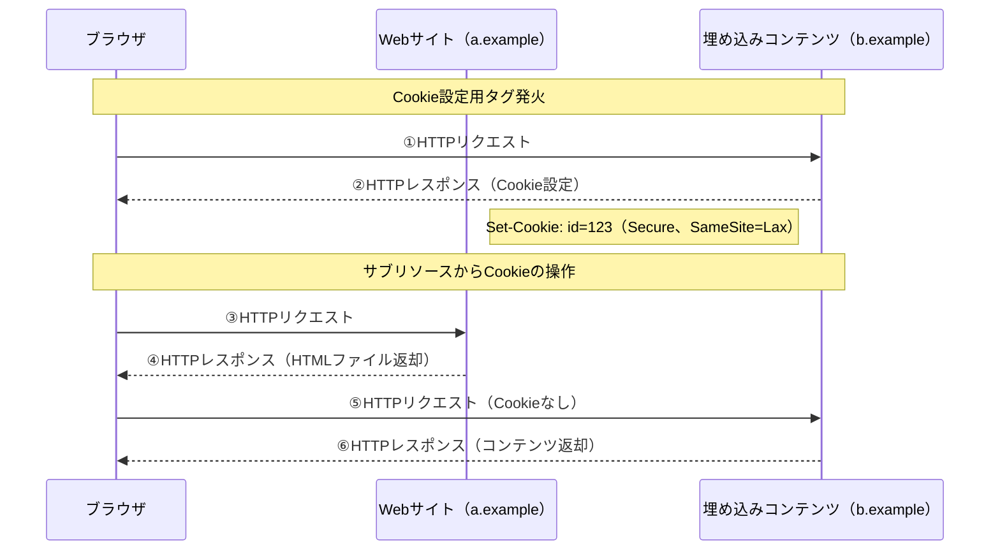
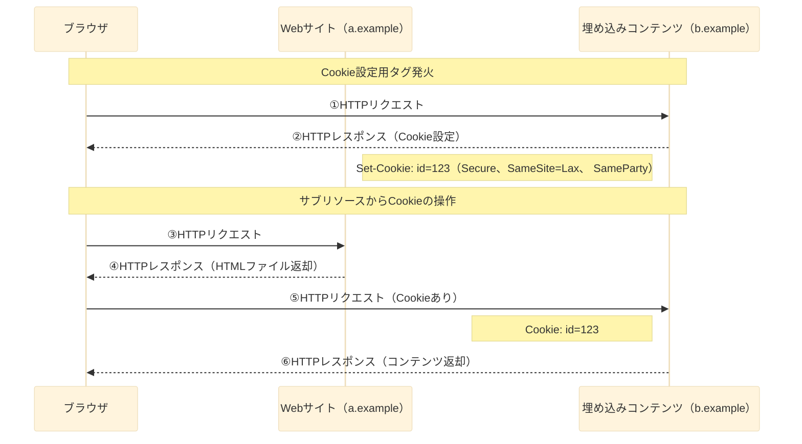

# First-Party Sets＆SameParty属性の活用例（Cookie設定要求〜埋め込みコンテンツ返却）

## 通常の場合
#### 3rd Party Cookieが規制されている状態において、b.exampleはサードパーティコンテキストにあたるため、Cookieにアクセスすることができない。

 →⑤のリクエストヘッダーにCookieが含まれない

## 機能適応後の場合
#### First-Party Setsの宣言とSameParty属性によって、b.exampleはファーストコンテキストという扱いになり、Cookieにアクセスすることができる。

→⑤のリクエストヘッダーにCookieが含まれる
